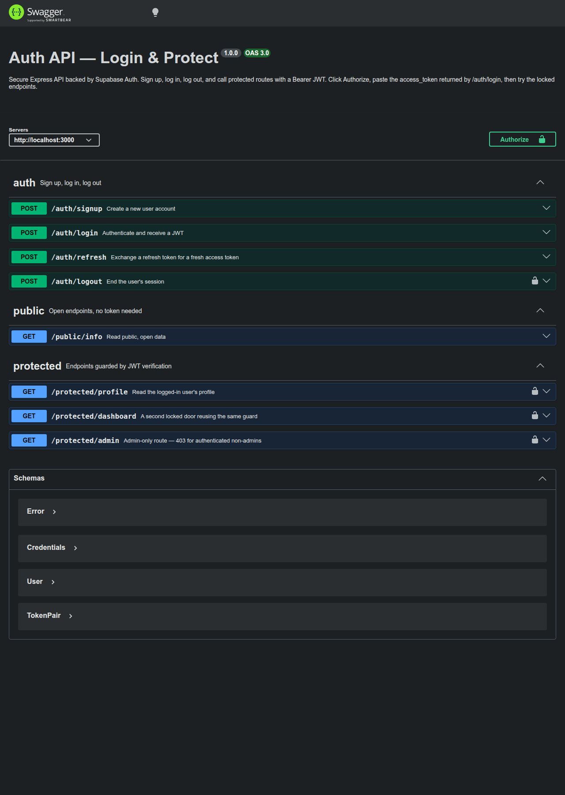

# Auth API — Login & Protect

A secure Express API that handles user authentication — **sign up, log in, log out** — and protects routes so they answer only for logged-in users. [Supabase Auth](https://supabase.com/docs/guides/auth) is the Identity Provider: it stores accounts, hashes passwords, and signs the JSON Web Tokens. This server never touches a password store or a hashing function — it forwards credentials to Supabase and **verifies the tokens Supabase hands back** before opening any protected door.

## How it works — the trust triangle

1. The client sends credentials to Supabase (through `POST /auth/signup` / `POST /auth/login`).
2. Supabase checks them and returns a signed JWT (the `access_token`).
3. The client calls this API with `Authorization: Bearer <token>`.
4. A single `requireAuth` middleware asks Supabase `auth.getUser(token)` — real verification, not a local guess — and attaches the verified user to the request. Invalid, tampered, or expired tokens are refused with `401`.

## Stack

- **Node.js ≥ 20** with **Express 5**
- **@supabase/supabase-js** — Supabase Auth SDK (signUp, signInWithPassword, getUser, signOut)
- **dotenv** — loads git-ignored secrets from `.env`
- **swagger-ui-express** — interactive docs with bearer auth at `/docs`
- **node:test + supertest** — integration tests against a faked Supabase client (no network needed)

## Setup

### 1. Create a free Supabase project

1. Sign up at [supabase.com](https://supabase.com) (free, no card) and create a new project.
2. In the dashboard, open **Project Settings → API** and copy the **Project URL** and the **anon key**. Only the anon key is used here — never the `service_role` key, which bypasses all security.
3. For this practice project, open **Authentication → Sign In / Providers → Email** and turn **"Confirm email" off**, so a fresh signup can log in immediately. (In production you would leave it on.)

### 2. Configure the environment

```bash
cp .env.example .env
```

Fill in your values:

```
SUPABASE_URL=https://your-project-ref.supabase.co
SUPABASE_KEY=your-anon-key
PORT=3000
```

`.env` is git-ignored and must never be committed.

### 3. Install and run

```bash
npm install
npm start
```

The server logs `Server running on http://localhost:3000` followed by `Connected to Supabase`. Swagger UI is at [http://localhost:3000/docs](http://localhost:3000/docs).

## API reference

| Method | Endpoint               | Auth required                 | Success | Errors                                     |
| ------ | ---------------------- | ----------------------------- | ------- | ------------------------------------------ |
| POST   | `/auth/signup`         | none                          | `201`   | `400` missing/invalid input                |
| POST   | `/auth/login`          | none                          | `200`   | `400` missing input · `401` bad credentials |
| POST   | `/auth/logout`         | `Authorization: Bearer <token>` | `204`   | `401` missing/invalid token                |
| POST   | `/auth/refresh`        | none (needs `refresh_token` in body) | `200`   | `400` missing token · `401` invalid token  |
| GET    | `/protected/profile`   | `Authorization: Bearer <token>` | `200`   | `401` missing/invalid token                |
| GET    | `/protected/dashboard` | `Authorization: Bearer <token>` | `200`   | `401` missing/invalid token                |
| GET    | `/protected/admin`     | `Authorization: Bearer <token>` + admin role | `200`   | `401` not logged in · `403` not an admin   |
| GET    | `/public/info`         | none                          | `200`   | —                                          |

Every error is JSON: `{ "error": "<message>" }`.

## Swagger UI

Open [http://localhost:3000/docs](http://localhost:3000/docs), click **Authorize**, paste the `access_token` from `/auth/login`, and use **Try it out** on any locked route — no curl needed.



## Try the full flow with curl

```bash
curl -i -X POST http://localhost:3000/auth/signup \
  -H "Content-Type: application/json" \
  -d '{"email":"test@example.com","password":"password123"}'

curl -i -X POST http://localhost:3000/auth/login \
  -H "Content-Type: application/json" \
  -d '{"email":"test@example.com","password":"password123"}'

TOKEN=<paste the access_token from the login response>

curl -i http://localhost:3000/public/info
curl -i http://localhost:3000/protected/profile -H "Authorization: Bearer $TOKEN"
curl -i http://localhost:3000/protected/profile -H "Authorization: Bearer ${TOKEN}x"
curl -i -X POST http://localhost:3000/auth/logout -H "Authorization: Bearer $TOKEN"
```

Expected: `201` → `200` with tokens → `200` public → `200` profile → `401` for the tampered token → `204` logout.

## Tests

```bash
npm test
```

The suite runs fully offline and never touches a real Supabase project:

- `tests/api.test.js` covers every endpoint and status code (400/401/403/429 validation, tampered tokens, middleware reuse, Swagger's bearer scheme) against a faked Supabase client.
- `tests/sdk.integration.test.js` goes further: it runs the **real `@supabase/supabase-js` SDK** against an emulated Supabase Auth server (`tests/emulatedSupabase.js`) speaking the GoTrue wire format over real HTTP, proving the routes handle the SDK's actual request/response shapes — no API key required.

## Project structure

```
src/
  server.js               boots the app, checks the Supabase connection
  app.js                  wires routes, middleware, Swagger UI
  supabase.js             creates the Supabase client from .env
  middleware/requireAuth.js   the one reusable guard: extracts + verifies bearer tokens
  routes/auth.js          signup, login, logout, refresh (+ login rate limiting)
  routes/protected.js     profile, dashboard, admin (all behind requireAuth)
  routes/public.js        open endpoint
openapi.json              OpenAPI 3 spec with the bearerAuth security scheme
tests/                    node:test + supertest suite with a faked Supabase client
```

## Extras

### 401 vs 403 — the difference is authorization

- **`401` means "I don't know you"** — the token is missing, malformed, or fails Supabase verification. Authentication failed.
- **`403` means "I know you, and no"** — the token verified fine, but the account lacks the required role. Authorization failed.

`GET /protected/admin` demonstrates this: any logged-in user gets `403` unless their `app_metadata.role` is `admin`. Roles live in `app_metadata` because users cannot edit it themselves (unlike `user_metadata`). To promote a user, run this in the Supabase SQL editor:

```sql
update auth.users
set raw_app_meta_data = raw_app_meta_data || '{"role": "admin"}'
where email = 'test@example.com';
```

### Refresh flow

`POST /auth/refresh` exchanges the `refresh_token` from login for a fresh token pair. Access tokens are deliberately short-lived (one hour by default) so a stolen token has a small blast radius — the refresh token is what keeps users logged in without re-entering credentials.

### Login rate limiting

After 5 failed attempts for the same account+IP within 15 minutes, `POST /auth/login` answers `429` — even for the correct password — until the window expires. Brute-force protection lives at the login door because that is the only endpoint where an attacker can test guesses; a successful login resets the counter. Tune with `LOGIN_MAX_ATTEMPTS` and `LOGIN_WINDOW_MS` in `.env`.

### Stateless logout

`POST /auth/logout` asks Supabase to end the session, but a JWT already issued stays cryptographically valid until it expires — that is the trade-off of stateless tokens, and exactly why they are short-lived and paired with refresh tokens.

## Security notes

- `.env` is git-ignored; only `.env.example` with placeholders is committed.
- The API uses the **anon key** only — the `service_role` key never appears in this codebase.
- Tokens are verified server-side with `supabase.auth.getUser(token)` on every protected request; nothing is trusted client-side.
